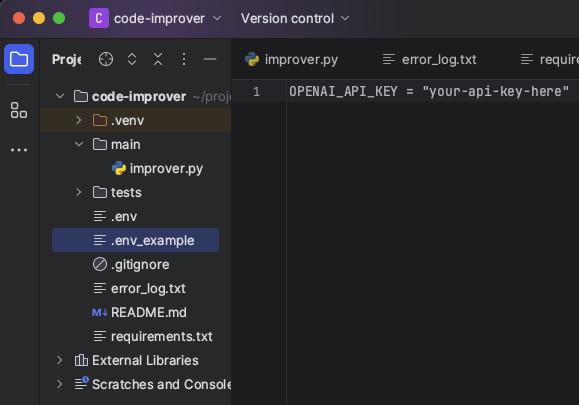
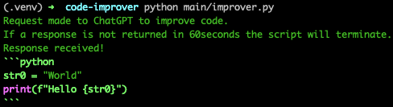
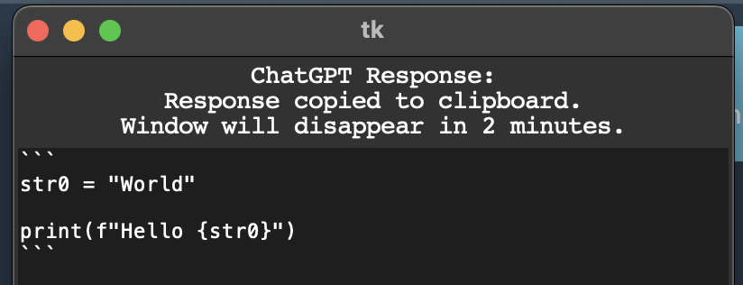
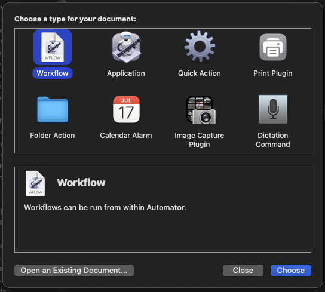
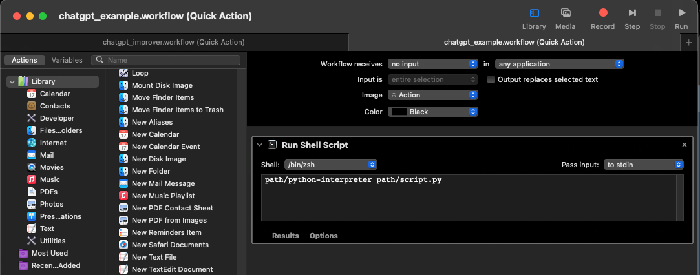
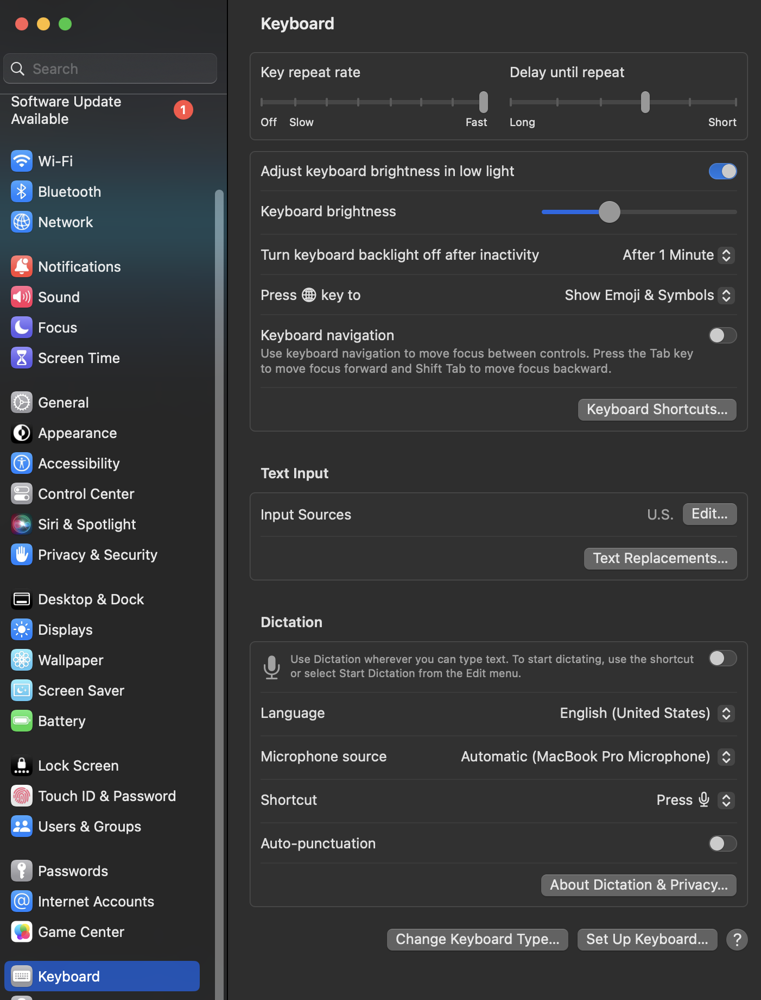
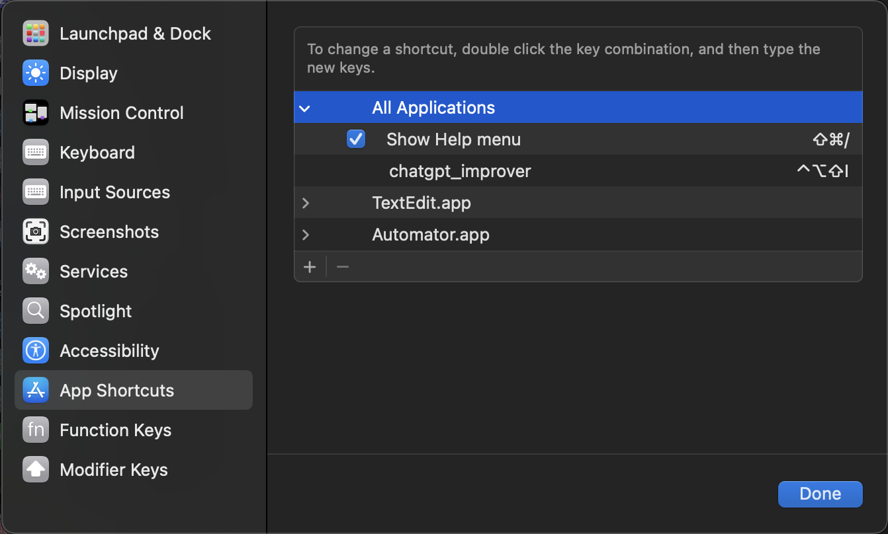
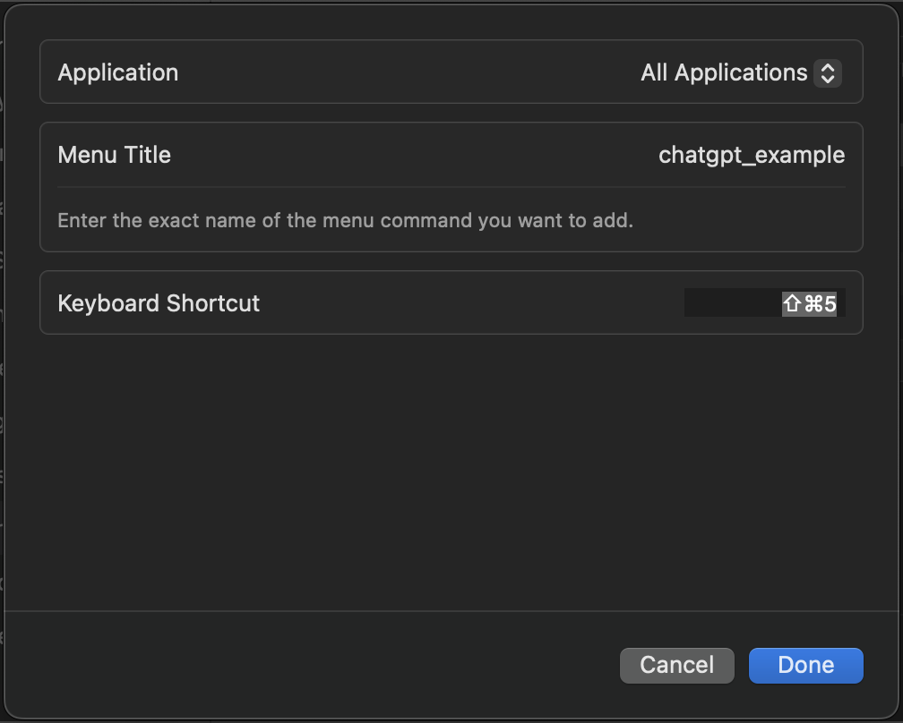
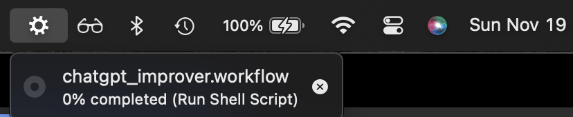

# ChatGPT Code Improver

### Author
Jacob Bassett

### Contact
You can find him on [LinkedIn](https://www.linkedin.com/in/jacobbassett/) and [Github](https://github.com/jdabassett)

### Date
11/19/2023

### Version
1.0.0

### Description 
This application will take code from the client's clipboard and make an API request to ChatGPT asking it to return an "improved" version. The response will be copied to the client's clipboard and a GUI will also opened to display the response. Note that the display can be closed manually or will disappear after 2 minutes.

This script can be enhanced by incorporating the use of key shortcuts to automatically make the request after copying the 'code' to a client's clipboard.

### Testing
Run the following command within the terminal to run all unit tests. Frankly there are not a lot of good tests. :(

`pytest`

### Usage
These steps were taken on a MacOS but the equivalents can be found on Windows and Linux. The developer only has a MacOS to work from so cannot provide those details. I'm sure ChatGPT can help there. ;)

1. Download this repository to your machine.
2. Activate local environment and install all dependencies. (see Tools)
3. Retrieve an API key from your ChatGPT account. [(medium article)](https://medium.com/@onlinemsr/how-to-get-chatgpt-api-key-a-step-by-step-guide-e32aae44834c)
4. Create a .env file in your local directory, add your API key to it. Look to the .env_example file I have included for an example.

5. Run the script within the local directory to be sure that it is working properly. Copy some code that you think can be improved and run the script from the terminal. Some exceptions will be raised and logs made to the 'error_log.txt' file to help you diagnose any problems. If all is working expect to see the following in the terminal and in the GUI.

6. Once it is working locally you can set up the key shortcut. Type 'command+space' to open Searchlight. Search for Automator.app and open it. Select 'Quick Action' from the prompt window.

7. Copy absolute paths to the virtual environments interpreter and the 'improver.py' script. 
8. Create a workflow. Specify "Workflow receives no input in any application". Search for 'Run Shell Script' and add it to the workflow. Add the paths from the previous step into the 'terminal' as seen below. Save the workflow in the Applications folder.

9. Open your Settings> Keyboard> Keyboard Shortcuts> App Shortcuts> All Applications hit the "+" and add a shortcut to run you application.

10. You should be good to go. You can tell if the scrip is running by watching the toolbar.

### Tools
annotated-types==0.6.0

anyio==3.7.1

certifi==2023.11.17

distro==1.8.0

h11==0.14.0

httpcore==1.0.2

httpx==0.25.1

idna==3.4

iniconfig==2.0.0

markdown-it-py==3.0.0

mdurl==0.1.2

openai==1.3.3

packaging==23.2

pluggy==1.3.0

pydantic==2.5.1

pydantic_core==2.14.3

Pygments==2.17.1

pyperclip==1.8.2

pytest==7.4.3

python-dotenv==1.0.0

rich==13.7.0

sniffio==1.3.0

tqdm==4.66.1

typing_extensions==4.8.0
